# Report: order flow and price impact on Binance perpetuals

[← README](../README.md)

I measured order-flow memory and price impact on Binance USDT-M perpetual futures tick data. The first part replicates three classical microstructure results (long-memory order flow, the price response function, order-flow-imbalance linearity) and compares them with the equities literature. The second part carries them to a **121-symbol cross-section** and a **propagator deconvolution** that separates the bare impact kernel from flow memory. The third part fits a **41-symbol Hawkes endogeneity panel** and an **execution-cost replay** built on the measured kernels. The last part re-runs the cross-section (Q4) in five regimes and the endogeneity panel (Q6) in four: an adjacent month, two more Julys, and 2026-07 on both the fixed 2023 universe and the 2026 market's own. The native-universe run is Q4 only. The aim is to find out which results are laws and which are specific to June 2023.

Every question was chosen because a published benchmark exists. Each result below comes with its sample period, sample size, standard error and the main reason it might be wrong.

## Data

| | |
|---|---|
| Source | [data.binance.vision](https://data.binance.vision) public dumps (free, no account) |
| Market | USDT-M perpetual futures |
| Symbols | BTCUSDT, ETHUSDT (Q1–Q3); a 207-symbol universe with 121 analyzed (Q4–Q5); a 41-symbol endogeneity panel and a 6-symbol execution panel (Q6–Q7); the same 207-symbol universe for 2023-07, 2024-07, 2025-07 and 2026-07, plus the 2026 market's own 371-symbol universe for 2026-07 (Q8) |
| Regimes | 2023-06 (baseline), 2023-07 (adjacent month), 2024-07, 2025-07, 2026-07 (three years on, fixed universe), 2026-07-native (three years on, the 2026 market's own universe) |
| `aggTrades` | **105,147,096** raw prints, BTC + ETH, 2023-06 and 2023-07 |
| `bookTicker` | **114,231,299** L1 quote updates, ETH, **14 days**, 2023-06-01 to 2023-06-14 |
| Resolution | millisecond timestamps |
| Stored as | Parquet (~1.7 GB), lazily scanned with polars |

`aggTrades` carries `is_buyer_maker`, so the aggressor side is given and no Lee-Ready or tick-rule classification error enters the sign series. The 14-day `bookTicker` window is a data constraint: Binance discontinued `bookTicker` dumps after 2024-04, and 2023-06 onward is where they overlap with `aggTrades`.

Raw prints are collapsed into **aggressor events** before any analysis. All same-millisecond, same-side prints merge into one taker decision, because one market order sweeping several book levels prints as several rows. Skipping this step inflates the lag-1 sign autocorrelation by a factor of about 15 (Q0 below).

## Order flow, response and imbalance

### Order flow has long memory (Q1)

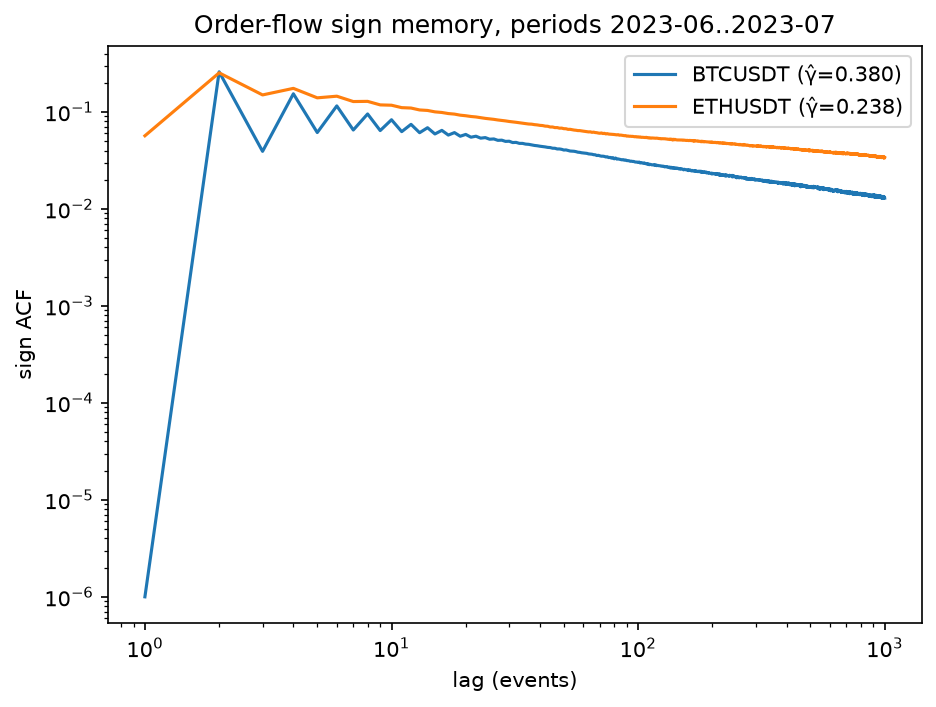

The autocorrelation of the buy/sell aggressor sign series, plotted log-log, where a power law is a straight line. Both symbols show long memory: correlation is still visible at lag 1000 and decays as `lag^(−γ)`, not exponentially. **BTCUSDT γ̂ = 0.3803** (n = 38,046,362 events) is inside the 0.3–0.7 range Bouchaud et al. (2004) report for equities and futures. **ETHUSDT γ̂ = 0.2380** (n = 25,773,466) is below it. A smaller exponent means slower decay, so ETH order flow is more persistent than typical equities. Candidate explanations are order splitting, retail herding, thinner books, or this two-month regime, and the data cannot yet separate them. The odd/even zigzag in BTC's curve below lag ~20 sits outside the [10, 500] fit window's influence on the reported slope. The quoted stderrs are OLS and understate true uncertainty, because ACF values at adjacent lags are themselves correlated.

[Full results and caveats →](../results/q1_results.md)

### The response function rises (Q2)

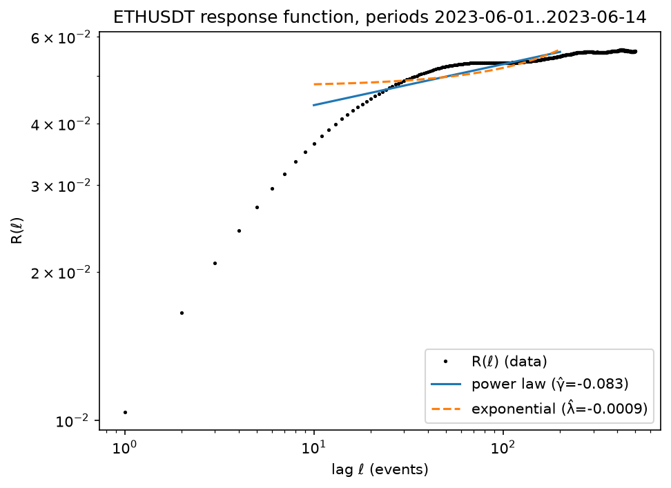

The average mid-price move in the aggressor's direction, ℓ events after a signed trade. **R(1) = 0.0104 rises to a plateau near 0.056 around ℓ ≈ 300–500, a ratio of 5.39×.** Impact does not decay here, which is the expected shape. The measured response R mixes the bare impact kernel G with order-flow memory C via `R(ℓ) ≈ G(ℓ) + Σ G(ℓ−n)·C(n)`. Only G decays; with long-memory flow the accumulation term dominates, so R climbs. Bouchaud's equity response functions show the same rise before a slow decline.

The quantitative check: Q1's ETH exponent γ ≈ 0.24 and the diffusivity-consistent kernel exponent β = (1−γ)/2 ≈ 0.38 predict R(500)/R(1) in roughly the **3.5–6.9×** band. The measured **5.39×** falls inside it, from a different dataset and estimator. Over lags 10–200 a power law fits better than an exponential (log-scale RSS **0.2161 vs 0.4718**). This measures R only. Separating G from C needs propagator deconvolution (Q5), and the sample is one 14-day window for one symbol.

[Full results and caveats →](../results/q2_results.md)

### Price change is linear in order-flow imbalance (Q3)

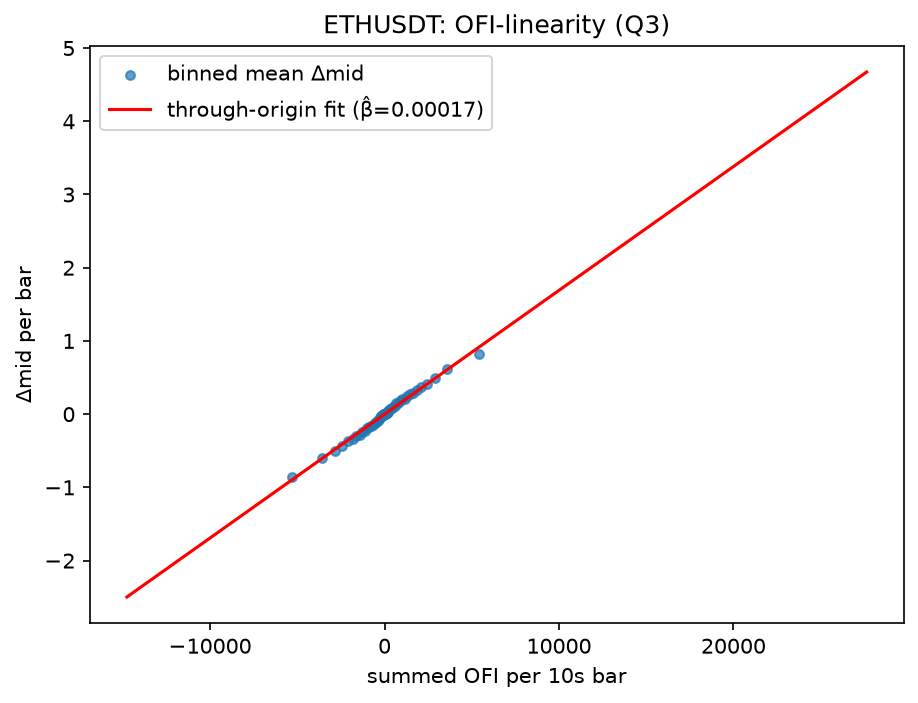

Binned mean mid-price change against summed order-flow imbalance over 10-second bars, with a through-origin fit. The relationship is linear across the full range of imbalance: **slope β̂ = 0.000169** over **120,960 bars**. **R² = 0.4019**, below the 65–70% Cont, Kukanov & Stoikov (2014) report for equities. The most likely reason is that Binance `bookTicker` publishes only the best bid and ask, so this OFI is L1-only and blind to pressure at deeper levels. The 10-second bar length and Silantyev's (2019) finding that trade-flow imbalance dominates book OFI in crypto are other candidates.

The depth-scaling check is directionally right and monotone: slope falls from 0.000303 in the thinnest depth quintile to 0.000125 in the thickest, a **log-log exponent of −0.7741 against Cont's predicted −1**. That exponent is fit on five points spanning barely a factor of three in depth, with no confidence interval, so it suggests the right direction and does not reject the theory.

[Full results and caveats →](../results/q3_results.md)

### Aggregation and tie-break checks (Q0, Q1b)

- **Q0, aggregation effect.** Raw-print γ̂ is inflated by +0.29 to +0.50 relative to correctly aggregated γ̂ across all four symbol-months. It lands inside the equity range in some cells and overshoots it in others, so a literature-range check alone cannot tell the wrong pipeline from the right one. [Full results →](../results/q0_aggregation_effect.md)
- **Q1b, zigzag tie-break.** The short-lag odd/even alternation in Q1's BTC ACF is real structure and not an artifact of the deterministic same-millisecond tie-break. Its amplitude moves only 0.2% under a randomized tie-break and stays near baseline under netting. [Full results →](../results/q1b_zigzag.md)

## The cross-section and the impact kernel

Q4 runs the order-flow-memory statistics across a **121-symbol cross-section**. Q5 separates the impact kernel `G` from flow memory `C` with a **propagator deconvolution**, which closes the "R, not G" gap in Q2.

### Memory is liquidity-invariant; sign flips are not (Q4)

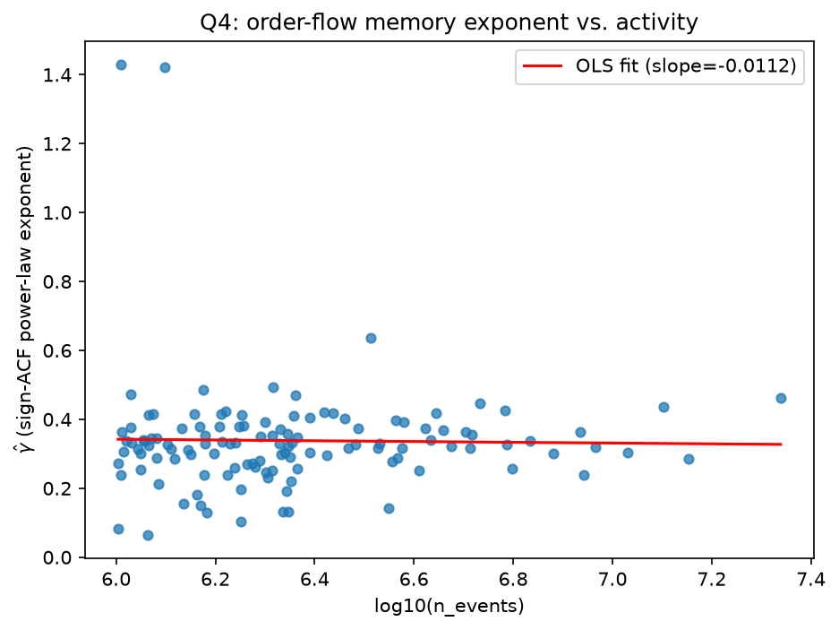
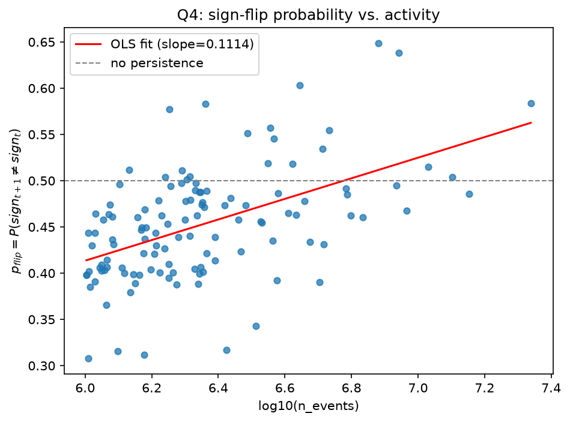

Q1's statistics on each symbol in a 207-symbol universe with ≥ 1M aggressor events in 2023-06: **121 succeeded, 86 fell below the threshold, 0 failed**, spanning 1.33 decades of activity.

**γ̂ does not track activity: slope −0.0112, R² = 0.0003.** The fitted line moves by −0.015 across the whole range against a cross-sectional spread of 0.167, and γ̂ itself varies from **0.065 to 1.429** (median 0.327, 79 of 121 inside the 0.3–0.7 equities range). **p_flip does track it: slope +0.1114 per decade, R² = 0.2632**, rising from a fitted 0.414 to 0.563 and crossing the 0.5 coin-flip line. Of the 20 most active symbols **8 are anti-persistent** (p_flip > 0.5, equivalently lag-1 ACF < 0); of the 20 least active, **none** are.

My reading is that long memory is roughly universal order-splitting behaviour and lag-1 structure is mechanical and competitive. That is a hypothesis. The main alternative is that p_flip tracks relative tick size, which correlates with activity and would make the law a bid-ask-bounce artifact. Q4b tests it. Regression stderrs are heteroskedastic across symbols and descriptive only, which is also why the γ̂ figure has no per-symbol error bars.

[Full results and caveats →](../results/q4_cross_section.md)

### Tick size: a borderline second factor (Q4b)

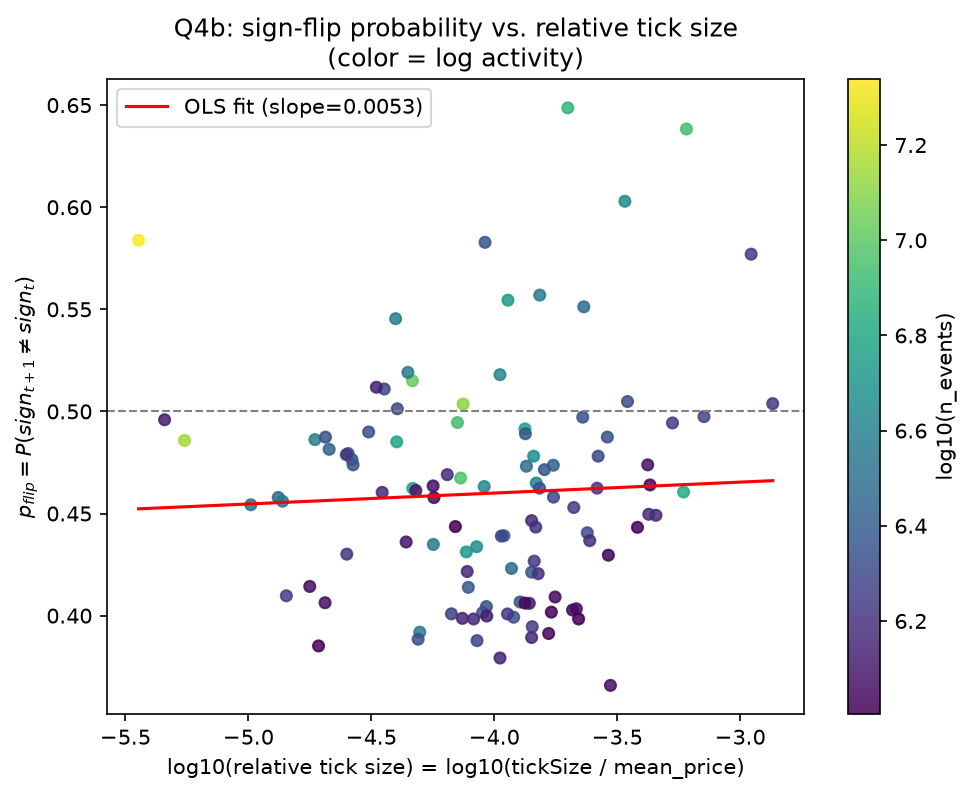

Q4's p_flip law regressed jointly on relative tick size (`tickSize / mean price`), using 111 of Q4's 121 symbols (10 dropped for missing current tick-size data, mostly delisted BUSD pairs). In `p_flip ~ log10(n_events) + log10(rel_tick)`, the **activity coefficient is +0.1130 (t≈7.14)** and the **tick-size coefficient is +0.0192 (t≈2.09)**. Activity is clearly distinguishable from noise; tick size sits just above a rough 2.0 cutoff, which with testnet tick sizes I treat as borderline and inconclusive. The collinearity was weaker than I expected (corr(log-activity, log-rel-tick) = **−0.21**). Univariate R² is 0.294 for activity alone, 0.002 for tick size alone, and 0.322 jointly. Activity is the dominant driver of the p_flip law; whether relative tick size contributes at all is not settled by this data.

Two caveats. Tick size is Binance's *current* `exchangeInfo`, not June 2023's. The mainnet endpoint returned HTTP 451 (geo-blocked) from the execution environment, so the numbers come from the futures **testnet** exchangeInfo mirror (schema-identical, spot-checked against BTCUSDT's known mainnet tick, not verified symbol by symbol).

[Full results and caveats →](../results/q4b_tick_confound.md)

### Critical balance holds for 12 of 16 symbols (Q5)

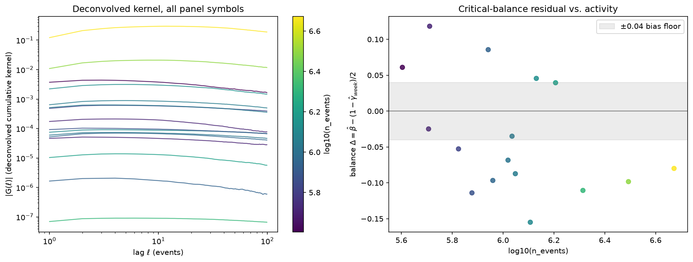

The deconvolved kernel exponent β̂ against the diffusivity prediction β = (1−γ)/2, on a 16-symbol panel over one week (2023-06-01..07). On synthetic data with a planted exponent of 0.35, across the three seeds `tests/estimators/test_propagator.py` runs, deconvolution recovers **0.377–0.397** where a naive fit to the response function returns **0.063–0.125** (seed 20 alone: 0.3766 vs. 0.0633).

Verdict: **12 consistent, 4 violated** (1000PEPEUSDT, OPUSDT, SOLUSDT, ARBUSDT) under `|Δ| ≤ 2·max(block_sd, 0.04)`. The tolerance is asymmetric. The 0.04 floor is the estimator's own measured finite-length bias (β̂ reads +0.03–0.04 too high), and because that bias is signed upward, negative deltas are understated. **11 of 16 deltas are negative, including all 4 violations** (−0.087 to −0.155). Bias correction would therefore produce more violations, and 12/16 is the most favourable reading the data supports.

Kernels decaying slower than critical would imply mildly super-diffusive prices, which is in unresolved tension with Q4's anti-persistent high-activity symbols. A violation is also equally consistent with the linear propagator being the wrong model for those books.

[Full results and caveats →](../results/q5_kernel_panel.md)

## Self-excitation and execution

Q6 asks how much of the order flow is the market reacting to itself. Q7 asks whether that changes how an order should be executed. Both rely on a Hawkes toolkit (simulator, MLE, model-free branching-ratio estimator), a business-time deseasonalizer and an execution-cost replay simulator.

### About 70% of trades are reactions to trades (Q6)

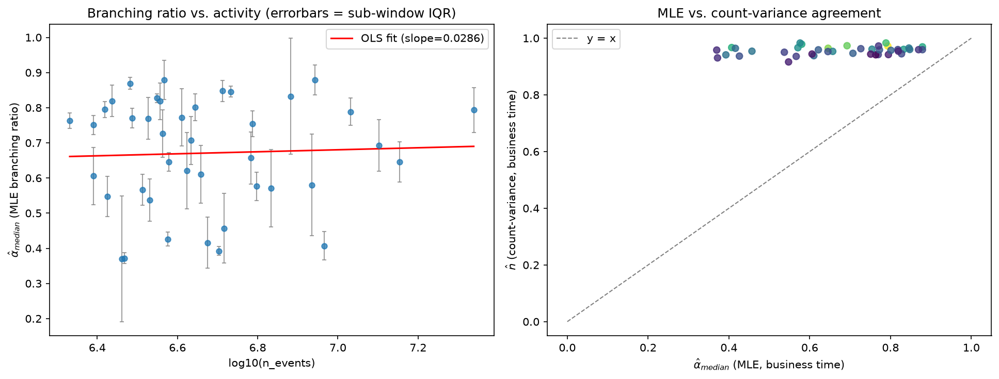

The Hawkes branching ratio is the fraction of events that are endogenous echoes and not arrivals from outside. I fit it across a **41-symbol** panel of 2023-06 aggressor flow (**41 successful, 0 failed**), six contiguous business-time sub-windows per symbol. **Median α̂ = 0.7070**, ranging 0.3699 to 0.8790. Roughly **70% of aggressor events are reactions to other aggressor events**, and total activity is amplified about 3.4× over the exogenous flow driving it.

Whether that is near-critical depends on the estimator. Under the exponential-kernel MLE, **zero of 41 symbols reach α̂ ≥ 0.9** (distance from criticality 0.2930 at the median). The model-free count-variance estimator puts **all 41 of 41** above 0.9 (median n̂ ≈ 0.959). The MLE number is a lower bound: an exponential kernel truncates the long-range excitation a power-law kernel would capture, so a power-law refit would push every number upward. That is the mechanism Hardiman et al. (2013) used to overturn Filimonov & Sornette's reflexivity trend, and it is why these numbers are not directly comparable to Mark, Šíla & Weber's (2022) power-law crypto estimates.

Two further results:

- **Endogeneity is liquidity-invariant.** Regressed on log₁₀(activity), the slope is **+0.0286** with stderr 0.1094 and **R² = 0.0017**. The stderr is four times the slope.
- **The two estimators disagree on every symbol, in one direction.** Median |α̂_MLE − n̂_count-variance| = **0.2395** (correlation 0.2597), with count-variance higher on **41 of 41**. Unanimity points to misspecification of the exponential kernel; Q6b below measures how much of the gap that explains.

I report the two estimators side by side and do not average them. The panel does not resolve whether crypto is near-critical.

The seasonality correction is measured on the real panel. On a regime-switching Poisson process with no self-excitation at all, the repo's own estimators report a spurious **n̂ = 0.934** and **α̂ = 0.976**. On the real panel the measured bias is **median raw_delta = −0.0003**. Crypto perps trade 24/7 with no open, close or lunch lull, so the intraday profile is nearly flat and there is little confound to remove.

[Full results and caveats →](../results/q6_endogeneity.md)

### A second kernel timescale closes about half the estimator gap (Q6b)

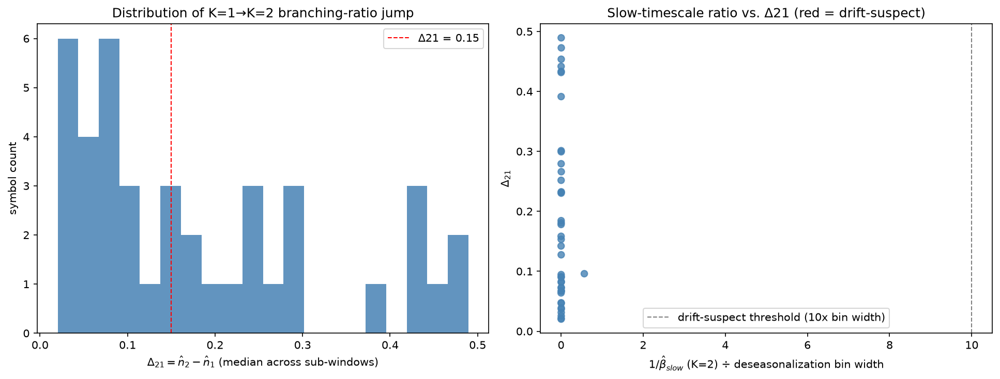

I refit the same 41 symbols and six sub-windows with sums of K = 1, 2 and 3 exponentials. The median branching ratio goes **0.707 → 0.854 → 0.879**. The K=1 → K=2 jump (Δ21) has median **+0.142** and exceeds a finite-sample null floor on **41 of 41** symbols (the 90th percentile of Δ21 across 5 simulations of single-exponential data at the panel's event count is 0.009). Against the count-variance estimator, the median gap falls from **0.240 at K=1 to 0.103 at K=2**, so K=2 closes a median **54%** of it. Across symbols, the K=2 estimate and count-variance n̂ correlate at **0.45**.

The added component is fast: its decay time 1/β_slow has a median of **7.0 business-time seconds** (90th percentile 10.5 s), against a 30-minute deseasonalization bin. That rules out leftover intraday seasonality as the source of the extra excitation.

Slower baseline drift is harder to rule out. For each symbol I compared the K=2 gain with a K=1 fit whose baseline is piecewise-constant over 12 blocks (about six business-time hours each), using a likelihood-ratio rule. The verdict is **inconclusive on 41 of 41**: 25 symbols show no K=2 rise in the test window, and 16 are mixed. At this sample size the test cannot separate drift from long memory.

I left one statistic out. Correlating Δ21 with the K=1 gap to count-variance gives 0.98, but both quantities contain −n̂₁, which varies far more across symbols than n̂₂ or count-variance n̂. With n̂₂ shuffled across symbols the correlation is still 0.97, so it carries no information.

[Full results and caveats →](../results/q6b_kernel_sensitivity.md)

### Execution: a risk/cost frontier (Q7)

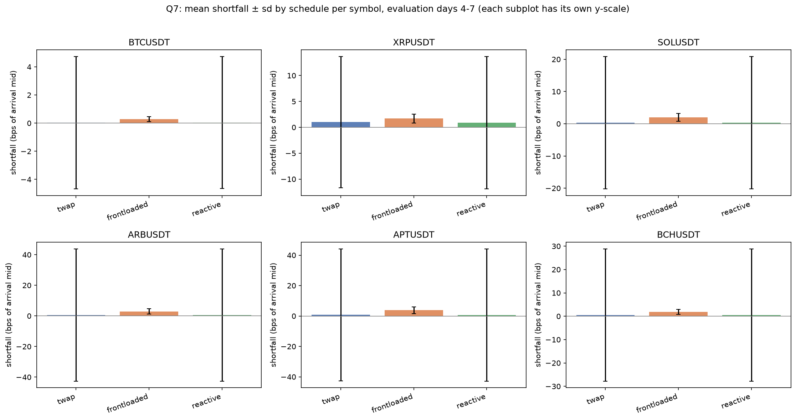

Three execution schedules (TWAP, front-loaded, and a Hawkes-motivated flow-reactive one) are costed against replayed 2023-06 flow on 6 panel symbols under one shared model: adverse drift + half-spread + own-impact from each symbol's **own measured Q5 kernel**. Shortfall is measured in basis points of the arrival mid, so symbols at different price levels pool on one scale. The reactive schedule's two parameters are grid-searched on **days 1–3 only** and frozen for evaluation on the disjoint **days 4–7**. The impact kernels are not held out: Q5 estimated them on days 1–7, so the own-impact term is in-sample.

**Reactive is cheaper than TWAP by 0.043 bps** (paired standard error 0.019 over 96 cells, about 2.2 SEs). That is detectable in this sample but negligible next to a cell-to-cell sd of 29 bps, and the cells share replayed days, so the SE is optimistic. What is clearly resolved is the dispersion: **front-loaded pays a higher mean cost (2.11 vs 0.55 bps) with a standard deviation of 1.75 bps against 29.3, about 17× lower, and lower on every symbol in the panel.** The mechanism is a trade of a deterministic cost for a stochastic one. Own-impact is charged predictably and front-loading incurs more of it. Adverse drift is the dominant noisy term and scales with how long you stay exposed. Which end of the frontier you want is a risk preference, and I take no position on it.

This is a model-based cost comparison and not a backtest or a trading recommendation. It has no queue, no latency and no partial fills, and the replayed flow cannot react to the simulated order, which cuts hardest against the reactive schedule.

[Full results and caveats →](../results/q7_execution.md)

## Does it hold over time? (Q8)

Every number above comes from **June 2023**. I re-ran the Q4 cross-section and the Q6 panel unchanged on four more months: **2023-07** (adjacent), **2024-07**, **2025-07** and **2026-07** (three years on). All four use the *same fixed 207-symbol universe*, so the panels are comparable across time. Symbols listed after June 2023 are excluded from those four regimes, so they describe what happened to the 2023 panel.

A fifth run, **2026-07-native**, repeats Q4 on the 2026 market's *own* 371-symbol universe (231 pass the 1M-event floor). It is free of the fixed-2023-panel survivorship. It still applies the 1M-event floor (138 of 371 fall below it) and contains only symbols that exist in 2026. Q6 was not run on the native universe.

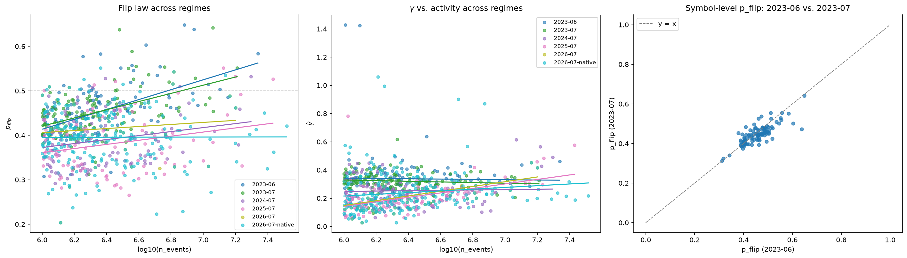

| regime | n | flip slope (stderr) | flip R² | γ R² | α̂ median (raw) | fast-mode share | α̂ median, slow-mode | n̂_CV median |
|---|---|---|---|---|---|---|---|---|
| 2023-06 (baseline) | 121 | +0.1114 (0.0171) | 0.2632 | 0.0003 | 0.7070 | 0.12 | 0.7526 | 0.9587 |
| 2023-07 | 117 | +0.0920 (0.0156) | 0.2328 | 0.0086 | 0.6925 | 0.12 | 0.7223 | 0.9425 |
| 2024-07 | 95 | +0.0448 (0.0199) | 0.0520 | 0.0013 | 0.3874 | 0.49 | 0.7024 | 0.9299 |
| 2025-07 | 94 | +0.0463 (0.0190) | 0.0608 | **0.2505** | 0.4847 | 0.33 | 0.5849 | 0.9329 |
| 2026-07 (fixed) | 46 | +0.0230 (0.0325) | 0.0113 | **0.2441** | 0.5766 | 0.31 | 0.6595 | 0.8903 |
| 2026-07-native | 231 | +0.0006 (0.0126) | 0.0000 | 0.0196 | n/a | n/a | n/a | n/a |

The Q6 panels behind the α̂ columns have 41, 41, 37, 33 and 32 symbols. The *fast-mode share* is the fraction of single-exponential fits with β̂ > 10 (decay faster than 0.1 business-time seconds).

### The flip law fades to nothing by 2026

Slope 0.1114 → 0.0920 → 0.0448 → 0.0463 → 0.0230 (**0.83×, 0.40×, 0.42×, 0.21×** baseline), R² 0.2632 → 0.2328 → 0.0520 → 0.0608 → 0.0113. The adjacent month is a clean out-of-sample pass. 2024-07 and 2025-07 are weakened but detectable, at roughly 2.3 and 2.4 stderr from zero, which is marginal. In 2026-07 the fixed-universe slope sits below its own stderr (0.0230 vs 0.0325). The native universe, 231 symbols spanning 1.52 decades of activity, gives slope +0.0006, stderr 0.0126, R² 0.000. The law is absent on both universes. The path is a step down between 2023-07 and 2024-07, a plateau through 2025-07, and nothing by 2026-07. With one month per year, that is as much shape as the data resolves.

A slope within 2 stderr of zero has no reliable sign, so the comparator's "slope is positive in every regime" is not evidence of persistence. Q8's verdict says the law is absent in 2026-07 and 2026-07-native.

### Survivorship does not explain the disappearance

An intact law measured through an emptied-out panel would return on the 2026 market's own universe, and it does not. A compressed activity axis is not visible in the fixed panel either: the log₁₀ activity spread of the 46 survivors is sd 0.296 (range 1.20 decades) against 0.279 (1.33) for the baseline, computed from the per-symbol `n_events` in the Q4 jsons.

The native run leaves composition open. It contains 192 symbols outside the baseline's successful set and shares only 39 with it. Those 192 include contract types absent in 2023: tokenized-equity-style perpetuals such as SKHYNIXUSDT, SNDKUSDT, MUUSDT and SOXLUSDT, and USDC-margined pairs. On the 39-symbol overlap p_flip rank-persists at ρ = 0.360. Q8's cohort split refits the law on three groups:

| cohort | n | flip slope (t) | flip R² | γ̂ slope (t) | γ̂ R² |
|---|---|---|---|---|---|
| 2023-06 data, shared symbols | 39 | +0.0999 (+4.04) | 0.306 | +0.0335 (+0.98) | 0.025 |
| 2026-07 data, same 39 symbols | 39 | +0.0307 (+1.12) | 0.033 | +0.1896 (+3.56) | 0.256 |
| 2026-07 new listings | 192 | −0.0023 (−0.17) | 0.000 | +0.0422 (+1.32) | 0.009 |

(From [`results/q8_regimes.md`](../results/q8_regimes.md).) Within the same 39 contracts the flip slope weakened from clearly present (t 4.0) to indistinguishable from zero (t 1.1), and the 192 contracts listed since show none. The supported claim is that the 2026 cross-section as a whole shows no p_flip-vs-activity law, and that on the shared contracts the law weakened.

### The γ̂ break is confined to the 2023-listed contracts

γ̂-vs-activity R² is 0.0003, 0.0086, 0.0013 through 2024-07 (slopes −0.0112, −0.0225, +0.0126), then **0.2505 in 2025-07** (slope +0.1588, n = 94) and **0.2441 in 2026-07** (slope +0.1683, n = 46). On the 2026 market's own universe, with the same estimator, R² is 0.0196 (slope +0.0612, stderr 0.0286, about 2.1 stderr but explaining 2% of the variance).

The cohort table locates the break. On the same 39 contracts γ̂ went from no activity dependence (slope +0.0335, t +0.98, R² 0.025) to a clear one (slope +0.1896, t +3.56, R² 0.256), while the 192 contracts listed since show a slope of +0.0422 (t +1.32, R² 0.009). The break is a within-cohort change among the 2023-listed contracts, diluted market-wide by newer listings. It is not a survivorship or selection artifact. Per-symbol γ̂ rank correlation on the 39-symbol overlap is ρ = 0.017, so which contracts have high γ̂ is unstable even where the cross-sectional slope is.

Drop-one-out checks leave the fixed-panel break's direction intact. The slope is positive under every single removal (2025-07 range 0.1373–0.1823, 2026-07 range 0.1442–0.1867). Its strength is outlier-sensitive: R² swings 0.1937–0.4666 (2025-07; ETHUSDT lowest, BTCDOMUSDT highest) and 0.1738–0.2959 (2026-07). Median γ̂ falls from 0.3221 in 2023-07 to 0.2386 in 2024-07 and then stays between 0.19 and 0.21 (0.1868, 0.1991, native 0.2071).

### Endogeneity drifts down, less than the raw medians suggest

The raw α̂ medians (0.7070, 0.6925, 0.3874, 0.4847, 0.5766) are not comparable across regimes because the fit changed character. In 2024-07, 2025-07 and 2026-07 a third to a half of the single-exponential fits have β̂ > 10. The MLE locks onto the fast component of a multi-timescale kernel, which understates α̂ by construction. The share is 0.12, 0.12, 0.49, 0.33, 0.31. Q8 flags only 2024-07 and 2025-07 (share more than 0.2 above baseline). 2026-07 (shift 0.19) is partly affected (raw 0.577 vs slow-mode 0.660) but below that threshold. The lowest raw median is 2024-07, the month with the most fast-mode fits, so the raw series cannot be read as a monotone drift. Two measures do not depend on the kernel mode:

- **Slow-mode α̂ median** (fits with β̂ ≤ 10 only): 0.753, 0.722, 0.702, 0.585, 0.660.
- **Count-variance n̂ median** (assumes no kernel shape): 0.959, 0.943, 0.930, 0.933, 0.890.

On symbols that are slow-mode in both months, the paired median Δα̂ against 2023-06 is **−0.023 (n = 34), −0.068 (18), −0.168 (19), −0.098 (22)** for 2023-07, 2024-07, 2025-07, 2026-07. The paired median Δn̂_CV is **−0.013, −0.027, −0.021, −0.061**. Both estimators agree on direction. The size is roughly 0.02–0.17 in α̂ and 0.01–0.06 in n̂, and it is not monotonic (2025-07 sits lower than 2026-07 in α̂ and higher in n̂).

The paired α̂ sets are small and selected on being slow-mode, so the Δα̂ figures carry more uncertainty than their precision suggests. A bootstrap of the median (4000 resamples) gives 95% intervals of [−0.276, +0.035] for 2025-07 and [−0.19, +0.024] for 2026-07, both including zero, so the two largest α̂ shifts are not distinguishable from zero. The 2023-07 and 2024-07 α̂ intervals and all four n̂_CV intervals exclude zero. The count-variance decline is the firmer evidence of direction.

α̂ stays liquidity-invariant: its activity slope is within 2 stderr of zero in every regime (R² ≤ 0.0725; 2025-07 is the largest, at n = 33). The MLE-vs-count-variance gap is 0.2395, 0.2636, 0.4656, 0.4198, 0.2977. Its jump in 2024-07 and 2025-07 coincides with the fast-mode shares (0.49, 0.33), but only partly: in 2026-07 the gap is back to 0.2977 (baseline 0.2395) while the fast-mode share is still 0.31. The fast-mode artifact is a candidate explanation for the jump and is not established. The gap is not clean evidence that the exponential-kernel lower bound is "doing more work" over time.

### Universe accounting

207 symbols were requested in each fixed regime and 371 for the native one.

| regime | requested | pass | below 1M-event floor | no data | baseline survivors |
|---|---|---|---|---|---|
| 2023-07 | 207 | 117 | 87 | 3 | 101 of 121 |
| 2024-07 | 207 | 95 | 80 | 32 | 73 of 121 |
| 2025-07 | 207 | 94 | 62 | 51 | 70 of 121 |
| 2026-07 (fixed) | 207 | 46 | 93 | 68 | 40 of 121 |
| 2026-07-native | 371 | 231 | 138 | 2 | 39 of 121 (overlap) |

The 68 no-data symbols in 2026-07 were cross-checked 68/68 against an independent download-missing record. Symbol-level rank correlation of p_flip with the baseline thins with distance: 0.758 (2023-07, 101 symbols), 0.570 (2024-07, 73), 0.317 (2025-07, 70), 0.292 (2026-07, 40), 0.360 (native, 39-symbol overlap).

The cohort split covers the 39 symbols shared with the native universe on both the 2023-06 and 2026-07 data. I did not run the same restriction on the 40 fixed-universe survivors. It is close in size to the shared set (40 vs 39 symbols) and would likely add little.

[Full results and caveats →](../results/q8_regimes.md)

## Reproducing from a fresh clone

### 1. Environment

```bash
git clone git@github.com:Varkot-dev/binance-microstructure.git
cd binance-microstructure
uv sync
```

Python 3.12+. Dependencies are polars, numpy, matplotlib, httpx; `uv sync` installs the dev group (pytest, ruff) too.

### 2. Run the tests

```bash
uv run pytest -m "not network" -q     # 268 tests: estimators vs synthetic ground truth
uv run ruff check src/ tests/
```

The estimators are checked against series with analytically known answers: i.i.d. signs (ACF exactly 0), a Markov chain (ACF = (2p−1)^k), FARIMA noise (γ = 1 − 2d), a known impact kernel the response estimator must recover, and a simulated Hawkes process with a planted branching ratio the MLE must recover. Two tests matter most for Q6. One plants a **regime-switching Poisson process with no self-excitation at all** and records that both branching-ratio estimators report spurious near-criticality on it (n̂ = 0.934, α̂ = 0.976). The other plants a **seasonal-baseline Hawkes process** and shows business-time rescaling recovers the true α to within 0.01 where a raw clock-time fit is inflated by +0.22 to +0.55. Add `-m network` to also run the live smoke test against a real Binance dump file.

### 3. Download and ingest the data

Download, checksum-verify, and convert to Parquet. Every file is checked against Binance's published SHA-256 and nothing reaches its canonical path unverified. Both commands are idempotent, so re-running skips what is already present.

```bash
# Monthly aggTrades: BTC + ETH, 2023-06 through 2023-07  (~0.9 GB as Parquet)
uv run python -c "
from pathlib import Path
from microstructure.data.catalog import sync
for sym in ('BTCUSDT', 'ETHUSDT'):
    sync(Path('data'), sym, 'aggTrades', '2023-06', '2023-07')
"

# Daily bookTicker: ETH only, 2023-06-01 through 2023-06-14
uv run python -c "
from pathlib import Path
from microstructure.data.catalog import sync_days
sync_days(Path('data'), 'ETHUSDT', 'bookTicker', '2023-06-01', '2023-06-14')
"
```

Optional integrity check: confirms `agg_trade_id` sequences have no gaps within a month and join correctly across month boundaries.

```bash
uv run python -c "
from pathlib import Path
from microstructure.data.catalog import continuity_report
print(continuity_report(Path('data'), 'BTCUSDT', '2023-06', '2023-07'))
"
```

### 4. Q1–Q3

Each writes its `.png`, `.md` and `.json` into `results/`. The defaults reproduce the figures above exactly, and the flags are shown to make the sample explicit.

```bash
uv run python -m microstructure.analyses.q1_orderflow_memory \
    --root data --out results --symbols BTCUSDT,ETHUSDT --periods 2023-06,2023-07 --max-lag 1000

uv run python -m microstructure.analyses.q2_response \
    --root data --out results --symbol ETHUSDT \
    --start-day 2023-06-01 --end-day 2023-06-14 --max-lag 500

uv run python -m microstructure.analyses.q3_ofi \
    --root data --out results --symbol ETHUSDT \
    --start-day 2023-06-01 --end-day 2023-06-14 --window 10s
```

Q1 is the heaviest of the three: an FFT autocorrelation over 38M events per symbol. Q2 needs the monthly `aggTrades` file covering the requested days plus every daily `bookTicker` file in the range, and aborts if more than 1% of events fail to join a prior mid.

### 5. Q4–Q5

Both universes are committed, so these reproduce the figures above exactly. `results/universe_2023-06.txt` holds the 207 requested symbols and `results/panel_2023-06.txt` the 16-symbol kernel panel.

Q4 needs monthly 2023-06 `aggTrades` for the whole universe (far more than the two symbols synced above). Q5 also needs daily `bookTicker` for its 16 panel symbols over 2023-06-01..07, which `q5_kernel_panel` syncs itself.

```bash
# Q4: 121-symbol cross-section (207 requested, skips below --min-events)
uv run python -m microstructure.analyses.q4_cross_section \
    --root data --out results --symbols-file results/universe_2023-06.txt \
    --period 2023-06 --min-events 1000000 --max-lag 1000

# Q5: 16-symbol kernel panel, one week
uv run python -m microstructure.analyses.q5_kernel_panel \
    --root data --out results --symbols-file results/panel_2023-06.txt \
    --month 2023-06 --start-day 2023-06-01 --end-day 2023-06-07 --max-lag 300
```

Q4 processes one symbol at a time and releases each frame before the next, so peak memory is set by the largest single symbol. Symbols below `--min-events` are skipped with a logged reason, and any other per-symbol failure is caught and recorded, so a run does not abort partway.

### 6. Q6–Q7

Q6 needs monthly 2023-06 `aggTrades` for its panel. It builds the 41-symbol union from `results/universe_2023-06.txt` plus `results/q4_cross_section.parquet`'s activity column, and writes the resolved list to `results/q6_symbols_2023-06.txt`. Q7 needs Q5's kernel file (`results/q5_kernel_panel.json`, committed) plus daily `bookTicker` for its 6 chosen symbols over 2023-06-01..07.

```bash
# Q6: 41-symbol branching-ratio panel (16-symbol panel ∪ top-40 most active)
uv run python -m microstructure.analyses.q6_endogeneity \
    --root data --out results --symbols-file results/q6_symbols_2023-06.txt \
    --month 2023-06 --windows 6

# Q7: execution-cost comparison, calibrate days 1-3, evaluate days 4-7
uv run python -m microstructure.analyses.q7_execution \
    --root data --out results --symbols-file results/panel_2023-06.txt \
    --kernels results/q5_kernel_panel.json --month 2023-06 \
    --start-day 2023-06-01 --end-day 2023-06-07 \
    --horizon-events 2000 --n-children 20
```

```bash
# Q6b: K = 1, 2, 3 kernel sensitivity on the Q6 panel, with the drift control
uv run python -m microstructure.analyses.q6b_kernel_sensitivity \
    --root data --out results --symbols-file results/q6_symbols_2023-06.txt \
    --month 2023-06 --windows 6 --ks 1,2,3 --q6-json results/q6_endogeneity.json --null-sims 50
```

Q6b is the slowest run in the repo, about 20 hours on one core. Q6 is the heaviest of the rest: 41 symbols × 6 Nelder-Mead multi-start MLE fits, plus one extra raw-clock-time fit per symbol to measure the seasonality bias. Each sub-window is capped at 250,000 events to bound the per-fit cost. Q7's calibration/evaluation split is hard-coded to the first three and remaining days of the requested range, so shifting `--start-day` / `--end-day` shifts both windows together.

### 7. Q8 regime comparison

Q8 reuses the Q4 and Q6 CLIs unchanged, pointed at a different month and output directory. The universe file is the same 2023-06 list in every fixed regime, since changing it would make the comparison uninterpretable. Each regime needs that month's `aggTrades` synced first. In later months many symbols have nothing to download, and that failure list is the survivorship record. The native-universe run swaps in the 2026 market's own universe file.

```bash
# Regime runs: Q4 cross-section for each period, same universe file
for PERIOD in 2023-07 2024-07 2025-07 2026-07; do
  uv run python -m microstructure.analyses.q4_cross_section \
      --root data --out "results/regimes/$PERIOD" \
      --symbols-file results/universe_2023-06.txt \
      --period "$PERIOD" --min-events 1000000 --max-lag 1000

  uv run python -m microstructure.analyses.q6_endogeneity \
      --root data --out "results/regimes/$PERIOD" \
      --symbols-file results/q6_symbols_2023-06.txt \
      --month "$PERIOD" --windows 6
done

# Native-universe run: Q4 only, on the 2026 market's own 371-symbol universe
uv run python -m microstructure.analyses.q4_cross_section \
    --root data --out results/regimes/2026-07-native \
    --symbols-file results/universe_2026-07_native.txt \
    --period 2026-07 --min-events 1000000 --max-lag 1000
```

```bash
# Q8: the comparator. Baseline is the committed 2023-06 results/ directory.
uv run python -m microstructure.analyses.q8_regimes \
    --out results \
    --baseline-dir results \
    --regime 2023-07=results/regimes/2023-07 \
    --regime 2024-07=results/regimes/2024-07 \
    --regime 2025-07=results/regimes/2025-07 \
    --regime 2026-07=results/regimes/2026-07 \
    --regime 2026-07-native=results/regimes/2026-07-native \
    --native 2026-07-native \
    --download-missing 2026-07=results/regimes/nonsurvivors_2026-07_download.txt
```

`--regime LABEL=DIR` is repeatable, and `--native LABEL` marks a regime that was run on its own universe, so it is compared by overlap and not by survivorship. `--download-missing LABEL=FILE` takes an independent list of symbols that had no data to download for that period and reconciles it against the Q4 run's own `failures` list, so a symbol dropped by a sync bug cannot be recorded as a delisting. For 2026-07 the two lists match exactly, 68 symbols in both. Without the flag the cross-check field is `null`.

Q8 recomputes every regression from the per-symbol records with its own OLS instead of trusting the upstream jsons' stored regression blocks, and reports any disagreement beyond 1e-06 as a warning. It reads only committed artifacts, so it runs in seconds and needs no `data/`.

## Repo map

```
src/microstructure/
├── data/
│   ├── binance.py      # dump-file URLs; SHA-256 verified download with caching
│   ├── ingest.py       # zip-CSV → Parquet; sniffs header presence and ms-vs-µs epochs
│   ├── catalog.py      # sync / sync_days, integrity and continuity reports
│   ├── events.py       # aggressor aggregation + the ±1 sign convention
│   └── jsonio.py       # strict JSON output (non-finite values become null)
├── signals/
│   ├── load.py         # Parquet → analysis frames; strictly-prior mid join
│   └── eventtime.py    # intraday rate profile + business-time rescaling
├── estimators/
│   ├── acf.py          # FFT sign ACF (Wiener-Khinchin) + log-log power-law fit
│   ├── response.py     # R(ℓ) = E[s_t · (m_{t+ℓ} − m_t)]
│   ├── ofi.py          # Cont-Kukanov-Stoikov OFI + through-origin OLS
│   ├── propagator.py   # Toeplitz kernel deconvolution + blocked β̂ uncertainty
│   └── hawkes.py       # Hawkes simulators (incl. seasonal-μ), MLE, count-variance n̂
├── execution/
│   ├── simulator.py    # replay cost model + TWAP / front-loaded / reactive schedules
│   └── cost_stats.py   # shortfall summaries and paired differences
├── analyses/
│   ├── q0_aggregation_effect.py # → q0_*.md/.json
│   ├── q1_orderflow_memory.py   # → q1_*.png/.md/.json
│   ├── q1b_zigzag.py            # → q1b_*.png/.md/.json
│   ├── q2_response.py           # → q2_*.png/.md/.json
│   ├── q3_ofi.py                # → q3_*.png/.md/.json
│   ├── q4_cross_section.py      # → q4_*.png/.md/.json/.parquet
│   ├── q5_kernel_panel.py       # → q5_*.png/.md/.json
│   ├── q6_endogeneity.py        # → q6_*.png/.md/.json/.parquet
│   ├── q6b_kernel_sensitivity.py # → q6b_*.png/.md/.json/.parquet (report in q6b_report.py)
│   ├── q7_execution.py          # → q7_*.png/.md/.json
│   └── q8_regimes.py            # → q8_*.png/.md/.json (regime comparator; report in q8_report.py)
└── synthetic.py        # series with KNOWN properties, for estimator validation

tests/                  # pytest; estimators checked against synthetic ground truth
results/                # figures + per-question write-ups with methodology and caveats
└── regimes/<period>/   # regime re-runs: Q4 + Q6 for 2023-07/2024-07/2025-07/2026-07, Q4 only for 2026-07-native
site/                   # static results site; build_data.py derives site/data/*.json
```

`data/` is gitignored; the sync commands above rebuild it.

## Limitations

- **Regime coverage varies by question.** Q4 has six regimes and Q6 five, but Q2 and Q3 are a single 14-day window on one symbol, Q5 a single **7-day** window, and Q7 a **4-day** evaluation window, none repeated. The regimes are single months, one per year after 2023, so month-to-month variation within a year is sampled once (2023-06 vs. 2023-07).
- **The fixed-universe regimes are survivorship-confounded, and the native run and cohort split separate that from the laws themselves.** On the fixed 2023 universe, 2026-07 returns **46 successful, 93 below the 1M-event floor, and 68 with no data at all** (2024-07: 95 / 80 / 32; 2025-07: 94 / 62 / 51). The 68 are delisted, renamed or migrated contracts (MATIC and FTM are migrations); the 93 reflect the 1M-event filter. The 2026-07-native run on the market's own 371-symbol universe (231 pass the floor, against 121 in the baseline) finds no flip law either (slope +0.0006, stderr 0.0126), so survivorship does not explain that disappearance. The γ̂ break (R² 0.2505 in 2025-07, 0.2441 in 2026-07) is small on the native universe (R² 0.0196), and the cohort split shows why. On the 39 contracts shared with the baseline γ̂ became activity-dependent (t +0.98 to +3.56) and the 192 newer listings show little (t +1.32). The native universe differs in composition (tokenized-equity-style perpetuals, USDC-margined pairs), has no Q6 run, still applies the 1M-event floor, and the shared cohort is 39 symbols, so the cohort slopes have wide intervals.
- **Q6 kernel-mode drift contaminates raw α̂ comparisons.** The share of single-exponential fits with β̂ > 10 is 0.12 in the 2023 months and 0.49, 0.33, 0.31 in 2024-07, 2025-07, 2026-07 (Q8 flags the first two; 2026-07 is partly affected, below its 0.2 threshold). Those fits capture only the fast component of a multi-timescale kernel and understate α̂ by construction. Comparisons here use the slow-mode α̂ median, the count-variance n̂ and symbols paired across months. The paired α̂ sets are small (18–34 symbols) and selected on being slow-mode.
- **Only one regime describes the 2026 cross-section, and only for Q4.** Post-2023 listings are excluded from the four fixed-universe regimes, so those describe the fate of the 2023 panel. 2026-07-native is the only run that includes the 2026 market's own symbols.
- **Exponential Hawkes kernels only.** Every Q6 branching ratio is a **lower bound**, because exponential kernels truncate long-range excitation a power-law kernel would capture. A second exponential (Q6b) closes a median 54% of the 41/41 MLE vs count-variance gap; the remaining 0.103 is unattributed, and count-variance window sensitivity is still a competing explanation. The drift-vs-memory test was inconclusive on all 41 symbols. A power-law refit and a window sweep are the follow-ups.
- **Q7 is a cost model.** It has no queue position, no latency, no partial fills, linear own-impact extrapolation, and replayed flow that cannot react to the simulated order, which undercuts the flow-reactive schedule it was built to test. The reactive-vs-TWAP mean difference is unresolved against its own noise, and only the front-loaded variance reduction is resolved.
- **Optimistic standard errors.** Every Q1–Q3 stderr is OLS, which assumes independent residuals. ACF values at adjacent lags share nearly all their data, and adjacent bars are autocorrelated, so the stated uncertainties are too small. Q4's cross-sectional regressions inherit the problem heteroskedastically. Q5 is the partial fix: it reports a block-bootstrap sd, having measured the OLS stderr to understate the true spread by **6.8×**. Block-bootstrap intervals for Q1 and Q3 remain to be done.
- **L1-only book data.** `bookTicker` gives one level, which plausibly explains both the low OFI R² and the depth-scaling exponent falling short of −1, and bounds every Q5 mid as well.
- **Linear-propagator assumption.** Every Q5 β̂ depends on impacts superposing linearly, and the balance relation β = (1−γ)/2 is itself a linear/diffusive prediction. A "violated" verdict cannot distinguish a different β–γ relationship from a nonlinear impact process.
- **Survivorship in the cross-section.** Q4's 121 symbols are those clearing 1M events. The 86 skipped are all low-activity, so the bottom of the activity regression is a filtered population. The fixed-universe regimes enlarge the filtered and missing share (2026-07: 93 below the floor, 68 with no data). The native run applies the same floor (138 of 371 below it), so the filtered-bottom caveat applies there too. It is the cohort split, together with the native run, that shows the flip-law disappearance is not explained by it.

## Literature

- **Bouchaud, Gefen, Potters & Wyart (2004)**, *Fluctuations and response in financial markets: the subtle nature of "random" price changes*. The response function, the propagator framing, the kernel-vs-response distinction, and the β = (1−γ)/2 diffusivity relation. Benchmarks Q1 and Q2.
- **Cont, Kukanov & Stoikov (2014)**, *The price impact of order book events*. The OFI construction, linearity, 1/depth scaling, and the 65–70% equities R². Benchmarks Q3.
- **Tóth, Lempérière, Deremble, de Lataillade, Kockelkoren & Bouchaud (2011)**, *Anomalous price impact and the critical nature of liquidity in financial markets*. Square-root impact and the latent-liquidity picture behind the temporary/permanent distinction.
- **Silantyev (2019)**, BitMEX order flow. Trade-flow imbalance outperforms book-based OFI in crypto, a candidate explanation for the Q3 R² gap.

## Summary and next steps

The flip law holds out of sample one month later, weakens through 2024–2025, and is absent in 2026 on both the fixed 2023 universe and the 2026 market's own, so survivorship does not explain its disappearance. Within the 39 contracts shared with the native universe it weakened to indistinguishable from zero (t 4.0 to 1.1), and the 192 contracts listed since show none. The γ̂ liquidity-invariance break (2025-07 and 2026-07) is a within-cohort change among the 2023-listed contracts (same 39 contracts, t +0.98 to +3.56), diluted on the 2026 native universe by newer listings that show little (t +1.32). Endogeneity drifts down moderately (roughly 0.02–0.17 in α̂, 0.01–0.06 in n̂ on paired symbols), not monotonically. The raw α̂ medians are contaminated by a kernel-mode switch in 2024–2025 (2026-07 is partly affected, below Q8's flag threshold).

Next, in order of how much each would change the conclusions:

1. A **power-law-kernel refit of Q6**. It would test whether crypto is near-critical, might remove the kernel-mode contamination at its root, and would show whether the half of the estimator gap that two exponentials leave is also kernel shape.
2. A **Q6 run on the 2026 native universe**. The native run covers Q4 only, so the endogeneity comparison still rests on the 2023 panel's survivors.
3. A **window-sensitivity sweep on the count-variance n̂**, the competing explanation for the estimator gap.
4. **Re-running Q4b against mainnet exchangeInfo** once network access allows it, to replace the testnet-mirror tick sizes (see [Q4b](../results/q4b_tick_confound.md)).
5. **β fit over disjoint lag windows**, to resolve whether Q4's anti-persistence and Q5's slow kernels are scale separation or estimator contamination.
6. A **repeat of Q2/Q3/Q5/Q7 on a disjoint week**, the one part of the single-window limitation Q8 did not touch.
7. Block-bootstrap intervals on γ̂ and the OFI slope, a Q3 bar-length sweep, and a signed-trade-volume comparison against book OFI, all using data already on disk.

---

**Results site:** <https://varkot-dev.github.io/binance-microstructure/>
